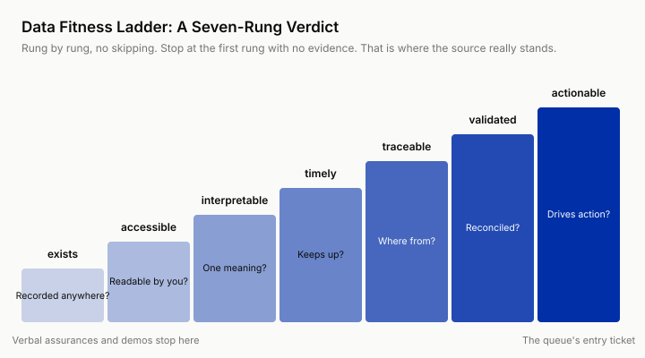

# 9 · Data Reality: Score Every Source on the Data Fitness Ladder

!!! info "Companion Templates"
    📋 [Chapter Template](../appendices/template-09-data-fitness.md) · 🗂 [Template Library](../appendices/template-library-index.md)

> **The Challenge.** The business side thumps its chest and says "the data is all in our system." Why is none of it usable the moment you touch it?
>
> **What You Will Be Able to Do.** Use the data fitness ladder's seven-rung verdict to measure how far a data source is from supporting action. Use three-way reconciliation to measure a field's real inconsistency rate and its inconsistency patterns. Assign a source of truth to each class of data on that evidence, and split the repair work into an engineering half and an operating half.

---

## Week 6, Tuesday Morning, Two Tables Side by Side

The read-only de-identified view opened Monday morning. Ten days of standoff, broken in the end by one sentence from Kevin Doyle in a hallway (Chapter 5). The first thing you do Tuesday morning has nothing to do with pipelines or models. You put two tables side by side on the screen. On the left, 200 auto exception claims the core system currently marks "in progress." On the right, Linda's tracker, the Excel sheet her team keeps, the source of truth you found while shadowing in Chapter 6, the one that actually reflects where a claim stands. Row by row.

By noon the result is in.

- **61 claims**, the core system says "in progress," the Excel says "waiting on the customer's documents," some of them waiting three weeks already, with nobody chasing.
- **17 claims**, effectively closed, the payout already landed, and nobody changed the status back.
- **9 claims**, carrying two mutually exclusive statuses in the core system and in the call center ticketing system, "in progress" on one side, "closed" on the other.

On the day of the Field MVP in Chapter 0, 3 of the 10 cases had a status field that did not match the description, and you put it in the friction log, taking it at the time for the bad luck of a small sample. With 200 in front of you, that is the population. 87 of the 200 cannot be taken at face value to drive an action, 44%. The largest and most insidious class among those 87 is the lagging pattern, 61 claims, about three in ten of the full 200. It is not wrong about whether a claim is finished. It buries the real reason a claim is stalled under the words "in progress," and what it misleads is exactly "what to do next." The same species of lie as those 3 of 10 on the MVP day.

At project approval Kevin had said, "The exceptions data is all in the system." He was not lying to you. At the level he can see, the sentence is entirely true. The fields are there, the reports run. The trouble is that a ladder stands between "we have it" and "it is usable," and the organization can see only the first rung. This chapter is about that ladder, and about using one reconciliation to pull a project back off a crack in it.

## Why This Is Hard: Fields Are a Process Trail, Not Facts

An engineer's first reaction is "the data quality is bad," as if this were an oversight at Anchor & Helm. It would be the same at any company. It is structural. The fields in the core system exist to leave a trail on the process, not to drive decisions. A reviewer changes a status because the button has to be clicked before the process can move to the next step. "Record reality" was never on her list of duties. So the update discipline on a field settles at exactly one line. Whatever audit can check is always accurate. Whatever audit does not check depends on the mood.

That line explains a telling detail in the reconciliation result. The status fields are a mess and the amount fields are correct almost claim for claim, because amounts run through finance reconciliation and audit watches that field. Same people, same system, and the discipline is worlds apart. A field's update discipline runs only as far as "audit finds nothing," and not an inch further.

This caused no disaster in the past, because every consumer of the fields was a person, and people come with error correction built in. Linda sees "in progress" and checks the email, looks at the Excel, makes a call. Every veteran assumes the fields cannot be fully trusted, and that assumption was never written in any document. In this company's history, AI is the first consumer that takes the fields at their word. It has none of that tacit correction. Whatever the field says, it believes, so it is the first to fall into the crack, marking a claim that should be chasing the customer as "internal rush," queuing a closed claim into the to-do list. The data gap among Chapter 1's five gaps, made concrete in the field, is the crack in this ladder.

## Prior Art, and What AI Changed

The ladder is not a new discovery. The data warehousing tradition set the rule thirty years ago. Data entering the warehouse has to answer "which source wins" first. That is source-of-truth discipline. One business fact recognizes one authoritative source, and everything else is a copy.

Kleppmann's *Designing Data-Intensive Applications* pushes the thinking up to the system level (paraphrased here). The system of record (the authoritative register for one business fact) has to be kept apart from derived data. Derived data (caches, indexes, rollups, model outputs) can be recomputed at any time but must never feed back into the source, or errors amplify in a loop. Data earns trust through lineage (where this value came from and who transformed it), not through a field name that looks true.

AI changed two things about this ladder, one up and one down.

**Up, the ladder gained a new way to climb.** "Waiting on the customer's documents," the real status, is nowhere in the core system, but it is in the email traffic between the surveyor and the reviewer. In the past that unstructured data was stuck on the bottom rung, because nobody could afford to structure it by hand. LLMs made extraction usable, and email, notes and call records can for the first time be lifted into an interpretable, even same-day, data source. Anchor & Helm's merged view later ate the mailbox signal for exactly this reason. But what comes out of extraction is still derived data, with an error rate of its own. This ladder gets laid out below, and its most expensive rung is called validated. That source has to climb all the way to validated too. Extractable is not trustworthy.

Down, AI itself became a new source of derived data. The queue generates dozens of "suggested next steps" a day, and three months on somebody will certainly cite them as "the record." If those outputs are written back into business fields, the next version of the model learns its own old output as fact. "Derived data must never feed back into the source" grew new teeth in the AI era. "Do fields written back by AI count as truth" is a question that did not exist before, and the first shape of the answer is that AI output may exist only as a decision trail, the suggestion, the reason, the Human Call, the timestamp, physically separated from the source fields (Chapter 17 works out the decision trail).

## Framework One: The Seven Rungs of the Data Fitness Ladder

To judge whether a data source can support one specific action, climb this ladder rung by rung. One test question per rung, stopping at the first rung where you cannot produce evidence. That is where the source really stands.



| Rung | Test Question | At Anchor & Helm |
|------|----------|----------|
| **exists** | Has this information been recorded anywhere? In which system, in which field? | Kevin's "it is all there" speaks only to this rung |
| **accessible** | Can you and the future system read it in a compliant, repeatable way? | About two weeks after the charter, opened through the trust network, with the approval flow no help (Chapter 5) |
| **interpretable** | Does the same value mean one thing across departments and across time? | "In progress" means different things in Claims and in customer service |
| **timely** | Does the update frequency keep up with the action you want to drive? | Status lags by the week, and the queue has to drive same-day action |
| **traceable** | Do you know where this value came from and who changed it? Are two systems talking about the same entity? | Claim report numbers are keyed in by hand and mistyped, so claims and tickets will not join |
| **validated** | Has it been reconciled against reality? What is the inconsistency rate, and in what pattern? | 87 of 200 cannot be used at face value, the largest class being the lagging pattern at about three in ten |
| **actionable** | Holding it, can the "next action" on that row of the queue be carried out by a specific person, and can an error be caught? | Status plus missing documents plus waiting time, all present, is the entry ticket to the queue |

Run the claim status field through it. Before the reconciliation it had cleared exists and accessible only, and it stuck at the interpretable question. Whether "in progress" means the same thing in two departments, you had no evidence. After the reconciliation, the core system's status field has an answer at the validated rung, 87 of 200, fail. The merged view settled on Friday recognizes Excel as its one source. The Excel is updated the same day, lineage is marked on the cell, and interpretable, timely and traceable all clear. Validated waits for the retest during the pilot, and until then it stops at traceable. In pilot week 4, project week 13, what gets retested is the core system's status field after the daily write-back discipline, another 200 claims sampled and the handlers asked, and only 9 do not match, all of them simply not updated yet that day. Validated clears. Half the credit belongs to engineering, half to the status write-back discipline Kevin claimed at gate three in Chapter 14, where the review team clears status before leaving each day. The actionable rung waits for the acceptance record after the queue goes live (Chapter 17).

Three rules of use. **First, judge rung by rung, no skipping.** The organization's verbal assurance covers only exists, and a successful demo proves only accessible, exactly the two cheapest rungs. **Second, fitness is relative to an action.** The same table may top out supporting a monthly report and reach only the second rung supporting same-day chasing. Write the action down before you score. Do not ask "is this data good." Ask "does it deserve this action." **Third, fitness is a state, not a property.** Validated today does not mean validated in three months, and the failure modes settle that account.

The internal reader has one more hurdle to climb, "it is all in the data lake already." The company spent years building a data lake or a data platform, every system's tables were synced into it, and from IT to the business owner to you, everyone assumes the six rungs above exists were solved along with it. Syncing solved the hauling only. Permission approvals, definition dictionaries, update latency, cross-system keys, not one of them was solved. The data platform saying "fully synced" is not evidence. The evidence is you running the target action against that table and being able to report its inconsistency rate. Kevin's "the exceptions data is all in the system" is, on an internal project, often said by you or by your manager at the project approval meeting. What you lack, compared with an outsider, is exactly one pair of eyes that does not believe that sentence.

## Framework Two: Three-Way Reconciliation

The most expensive rung on the ladder is validated, because it has no shortcut. The only way is to reconcile the data against reality. The method itself is plain. The discipline is in the details.

1. **Define the standard first, then sample.** Write down in black and white what counts as inconsistent, then look at the data. Reverse the order and you will quietly tune the standard until the result looks good.
2. **Sample N records.** 50 to 200, covering typical cases, edge cases and aged claims (the longest-waiting claims are where field discipline is worst).
3. **Check three ways.** Every record against three sources. The system field (the official version), the private source of truth (the Excel, the email threads, the ones the archaeology of Chapter 6 dug out), and asking the handler (on disputed records, ask the person handling it directly, "where does this claim actually stand right now"). Two ways can only find "they differ." Only the third can rule on "who is right."
4. **Produce something beyond two numbers.** The inconsistency rate (the total rate together with the largest single class, both reported) is for the decision. The inconsistency pattern (lagging? forgotten? semantic divergence? broken join?) is for the fix, and the prescriptions for different patterns have nothing in common.
5. **Turn the result into decisions.** Assign one source of truth per class of business fact. Write down which half of the repair is engineering and which half is operating. Write down the retest date.

You had a feeling already. In Chapter 5, in the forty minutes spent automating Kevin's monthly spreadsheet, the two definition errors you fixed along the way were the interpretable rung showing itself for the first time. That spreadsheet is the first-hand material for this reconciliation, and you knew which fields to doubt before IT did.

The advantage compounds. You spend years fixing definitions and rebuilding reports for one team after another, and every fix teaches you one more field's temperament, while an outsider starts from zero at each new company. The same depth gives you two other things. Change tickets and release records from past system upgrades are yours to pull, so tracing lineage at the traceable rung is an order of magnitude easier. The handler of a mutually exclusive claim sits two floors away, so the third way, asking the handler, costs you nothing, and that step is the only one in a reconciliation that can rule on who is right.

## At Anchor & Helm: Four Ways to Lie, One Merged View

Wednesday afternoon, you take the 9 mutually exclusive claims and a sample of the disputed ones to the third way and ask the handlers. The first three inconsistency patterns surface.

**The lagging pattern (61 claims).** The status is true, only slow. After a reviewer sends the request for documents, the Excel is updated the same day, and the core system does not move until the claim is routed again, sometimes three weeks later. The prescription is a faster source (the Excel, the mailbox). Engineering can solve it.

**The forgotten pattern (17 claims).** The claim is effectively closed. Changing the status is an action no process forces and no person is affected by, until your queue becomes the first victim. The prescription is operating discipline. Engineering cannot solve it.

**Semantic divergence (9 claims).** "In progress" in Claims means "on my desk." In customer service's ticketing system it means "answered the customer, waiting for a reply." Two departments used one word to record different facts, and for ten years it hurt nobody, because no system had ever consumed both sides at once. The prescription is to align the semantics first and talk about syncing second. This is an organizational problem, not an ETL (extract, transform and load pipeline) problem.

But who convenes that semantic alignment meeting. That question is the genuinely hard one inside a company. Often you are the only one who will push it, and you have no authority to convene across departments. Convening power has only three sources. One, the sponsor authorizes it and hangs the meeting on his own weekly agenda, and one sentence, "the definitions behind the auto queue need both departments to confirm," is enough. That is the fastest route. Two, the company's existing data governance committee or master data management team, whose job semantic alignment already is, and you are only the proposer. Three, a personal relationship between the two department heads, usable, but a conclusion that leaves no record does not count. When you have none of the three, do not force the meeting. Fall back to the downgrade route. Write the two meanings into the value dictionary as separate columns nobody is allowed to merge, then put the divergence and its business consequence into the weekly report that copies the sponsor. Nothing moves the first time. After the second, it becomes the sponsor's agenda.

The reconciliation also pulled up an unplanned finding. The join key between claims and call center tickets is unstable. Tickets are joined by a claim report number customer service keys in by hand, one digit off makes an orphan, and the same claim can be found in several variants in the ticketing system. This is the fourth inconsistency pattern, the broken join, where two systems cannot line up the same entity. The "customer chase count" field therefore breaks at the traceable rung and is demoted to a reference signal, kept out of the priority logic. Linda's line in Chapter 0, "chase priority ≠ risk priority," was about business judgment. Here the data layer adds one more reason. The chase count itself does not line up with the claim.

| Pattern | Test Question | Prescription |
|------|----------|------|
| Lagging | Is the value true, only slow? | A faster source (the Excel, the mailbox), engineering can solve it |
| Forgotten | Is the status change forced by any process, and is anyone affected by it? | Operating discipline, engineering cannot solve it |
| Semantic divergence | Are two departments using one word to record different facts? | Align the semantics first, talk about syncing second |
| Broken join | Are the two systems talking about the same entity? | Demote to a reference signal, keep it out of the priority logic |

On Friday you take the reconciliation result into a one-hour meeting with Kevin and Linda, and it produces three decisions, written up as the source of truth decision log ([Template 9.4](../appendices/template-09-data-fitness.md)).

1. **The source of truth for claim status = the merged view**, with Excel as the authority, the core system as the fallback, and the extracted mailbox signal filling in the "waiting on documents" detail. The source of truth for amounts = the core system, where audit discipline happens to keep that field in line. One class of fact, one source of truth, with lineage marked on the cell.
2. **The merged view is purely derived and purely read-only**, writing back to no source system. That design later saved you half an hour at the security review run by Victor Reyes (Head of IT Security and Architecture). A derived view that does not feed the source keeps the audit boundary so clean he could not find anything to say (Chapter 12).
3. **"Writing status back to the core system" is listed as a business-side operating improvement for the pilot period**, owner Kevin. The review team spends ten minutes before leaving each day clearing status, and the queue produces a "status in doubt" list to help them find the ones to fix. This belongs to the business side's operating discipline, and it is not in your system's feature list. It has to be discussed first and started first, and the engineering half, the source swap, waits until it is settled, because it decides which source to swap to. Half the fix for a data problem is engineering, half is operating discipline, and you can only fix your half. Inside a company that sentence needs a footnote. You do not have the outside deliverer's line of division, and both halves will drift onto you. What replaces it is sequence, see the next section.

This reconciliation also left behind one data asset. The inconsistency rate, 87 of 200, 44%, became the baseline. When Chapter 11 builds golden cases, it is the floor figure for "how much error the data itself contributes."

## Who Owns Which Half, Sequence Replaces the Boundary

The outside deliverer has a very hard boundary. The engineering half is his deliverable, the operating half is the other side's housekeeping, and the division of labor sheet draws it plainly. You do not have that boundary. When Kevin gets busy, the least effortful landing for "status write-back" is "let the Digital Center figure something out in the system," and both halves drift onto you.

What replaces the boundary is sequence. Discuss the operating half first. Two reasons. The operating half runs on ten minutes at the end of another department's day, so every day you delay speaking is a day later it starts, while the engineering half you can do any time. And it comes first because whether Kevin puts his name to it decides which source the engineering half should swap to. If he does, the merged view is the authority. If he does not, you have to design for a core system that lags forever and find another signal. Reverse the order and you will finish the engineering half first, then discover it was built on an assumption nobody maintains.

The owner cannot be you. Putting your name on an improvement item of this kind announces that this half will not be fixed, and the engineering work is wasted even when it is done. So what you want from Kevin is not "support." It is his name in the owner column of the source of truth decision log, with a date.

How do you get him to write that name. Trade something for it, do not argue him into it. You give him two things. The first is decision rights over the source of truth. Which table is authoritative for claim status is his to decide, and your job is only to lay out the reconciliation evidence in full. Once it is decided, every downstream reading follows that definition, including when another department wants to plug in. The second is a say in the schedule. Once the operating improvement item sits under his name, it becomes a precondition for this project, the queue's launch schedule moves with it, and he has thereby gained a voice in the project's pace. You have to be equally clear about the other half. Without that name, the engineering half will not be built, because building it would only spin in place. That is not a threat. It is carrying "the fix has two halves" through to the end. This conversation happens in that one-hour meeting on Friday. Grant Whitmore does not need to be in the room, but the conclusion has to appear in the next weekly report that goes to him, so that a third person sees the claiming happen.

Finding nobody who will put a name to it is a real conclusion, not a failed conversation. Write it into the source of truth decision log, note that this class of fact has no operating owner, have the engineering side design for the worst case, and then honestly go swap the source, demote it, or shrink the scope.

## Failure Modes

**1. Using the analytics warehouse as an operating source.** Pulling from the BI (business intelligence) reporting store to drive same-day action, and every morning the queue chases claims that were resolved yesterday. The analytics store has the friendliest interface, the fullest documentation and the easiest permissions in the whole company. It was built to be looked at by people, and an engineer walking the path of least resistance toward it is entirely human. But T+1 data (today you can see only through yesterday) does not deserve a same-day action at the timely rung. A report can be a day late. Chasing cannot. The test is one sentence. Who was this source built to be consumed by? A source built for people to look at does not, by default, deserve to drive machine action.

**2. Underestimating permission time.** The architecture diagram is finished and the data has not been touched. The schedule says three days for "data access" and five weeks go by. Approval duration is owned by nobody in an organization. Each step takes only a few days, and no one is accountable for the total. And while your trust balance is still negative, the process is an open-ended "in progress" (Chapter 5). Data access is the hidden critical path on this kind of project. The request goes out in week 1, and the fix lives in the trust network, not in the ticketing system. At Anchor & Helm it took about two weeks after the charter, which counts as fast.

**3. Reconciling only once.** You reconciled during discovery (the stage of finding out how things actually are) and from then on "the data is fine" went into every report. That takes a one-time verdict for a permanent conclusion. Staff rotation, process revisions and upstream system upgrades all degrade it. The most insidious source of degradation is your own system. After the queue launches, Linda's team depends on the Excel less, and the appetite for maintaining that source of truth falls with it. Your system will kill its own source of truth with its own hands. So reconciliation needs a rhythm. Retest during the pilot, spot-check after launch (the monitoring in Chapter 18 takes over this line).

On someone else's project a retest is a delivery obligation, and when the date passes somebody asks. Inside, nobody will come and ask. Retesting during the pilot and spot-checking after launch are both things that will not hurt immediately if skipped, so they have to hang on a carrier that does not depend on your memory. Two options. One, into your own team's ops checklist, on the same sheet as certificate expiry and dependency upgrades, reviewed once a quarter. Two, into the quarterly data health report for the sponsor, one line per system, source of truth, last reconciliation date, inconsistency rate, retest conclusion, where the blank cells speak for themselves. The retest triggers need one more entry unique to the inside, "team staffing change." The person maintaining that Excel changed, or the person on your team who owns this line changed, and either one means running the reconciliation again.

## Next Monday

1. List the data sources for the project in front of you ([Template 9](../appendices/template-09-data-fitness.md)), including the ones you are embarrassed to call data sources, mailboxes and private spreadsheets. The truth often lives there.
2. Pick the most central field in the system, sample 50 records and run a three-way reconciliation, the system field, the private source of truth, asking the handler. Work out your own "87 of 200."
3. Triage with the inconsistency patterns. Lagging swaps the source, forgotten adds operating discipline, semantic divergence opens an alignment meeting first. Do not fix an organizational problem with ETL.
4. Check your architecture diagram. Does AI output get written back into any source field? If it does, change it to a decision trail today.

**Want an agent to get you started?** In the repo you set up following [Start Here](../index.md), paste this to your coding agent:

```text
In the repo/ directory of the the-last-mile repository, help me with the Chapter 9 Next Monday actions. Copy
templates/data-fitness/fitness-scorecard.md into the working directory I name. I list the data sources, and you are to
ask me directly whether sources such as mailboxes and private spreadsheets exist. Then run
python3 templates/data-fitness/reconcile.py on the built-in sample to demonstrate the three-way reconciliation summary,
then copy reconcile-records.csv into my own reconciliation log. I fill in the system field, the private source of truth
and the handler's answer for the 50 records, and you only compute the total rate and the largest single class.
The triage of inconsistency patterns (lagging, forgotten, semantic divergence) is mine to decide, do not judge for me.
If any command errors, stop and show me the output.
```

---

## Chapter Kit

- **Judgment frameworks.** The seven rungs of the data fitness ladder (exists → accessible → interpretable → timely → traceable → validated → actionable; judged rung by rung, relative to an action, and it degrades); three-way reconciliation (define the standard → sample → system field / private source of truth / ask the handler → inconsistency rate + inconsistency pattern → source of truth decision)
- **Templates.** [Template 9](../appendices/template-09-data-fitness.md), Data Source Inventory, Fitness Scorecard, Reconciliation Checklist, Source of Truth Decision Log
- **Key judgments**
  - "A field's update discipline runs only as far as 'audit finds nothing.' AI is the first consumer that takes the fields at their word."
  - "Half the fix for a data problem is engineering, half is operating discipline."
  - "Fitness is a state, not a property, and it degrades."
  - "A source built for people to look at does not, by default, deserve to drive machine action."
