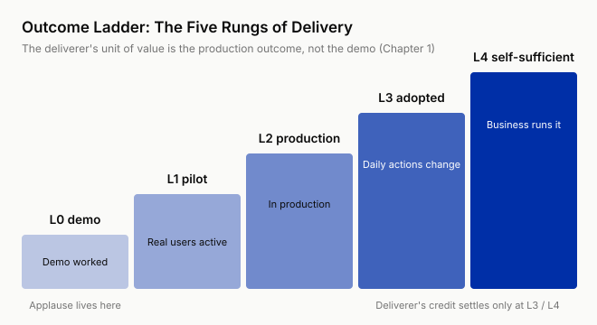
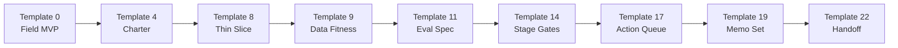

# Start Here

> **A demo is L0. Delivery is L4. Enterprise AI dies in the last mile, not in the model.**

The mortality curve of enterprise AI projects is not about model capability. Between demo and production lie five gaps, **data, workflow, trust, ownership, value**, and none of them can be filled by writing code. This book's unit of measure is the **outcome ladder (L0 demo → L4 self-sufficient)**, and the deliverer's unit of value is the production outcome, not the demo.



The 27 chapters follow the timeline of one delivery cycle from start to finish; the running case, "Anchor & Helm Insurance" (a fictional composite), runs from Chapter 0 to Chapter 26. The two technical anchors specific to the AI era are **Eval as Spec** (Chapter 11) and **From Dashboard to Action Queue** (Chapter 17).

Written for the people inside a company who are accountable for taking an AI project to production and into daily use, whatever their title. The ask comes from a business unit, the budget and your salary come from the company, and the outcome only settles when the business unit's daily actions change. The "you" in this book rests on two assumptions. You can build the system yourself, or have someone next to you who can. The project has a sponsor who can commit people and schedule, even if that is only your own manager. The "you" in the case sits in the Group's Digital Center, serving claims operations at the subsidiary Anchor & Helm Insurance, and the book follows one delivery cycle from week 1 to week 34. A contract, a price tag, and an exit date force four mechanisms out into the open for a vendor. Inside, not one of them exists; a single table in Chapter 2 tells you where each one hides and which chapter rebuilds it. The vendor-side FDE is where this method comes from; the [Vendor Crosswalk](appendices/internal-fde-mapping.md) maps every chapter to that seat.

## Five Reading Paths

| Who You Are | Entry Point |
|--------|------|
| An AI deliverer inside a company | Chapters 0 to 2, then straight into Part II (Chapter 4); if the project is on fire, check the table below first |
| A reader who does not build (business-side owner, digital transformation lead) | Chapters 0, 1, 2, 4, 5, 7, 8, 14, 19, 20, 21, 22, 25; read Chapters 9, 10, 11, 16 together with an engineering colleague |
| A manager running a delivery team | Chapters 0, 14, 22, 23, 25 plus all 24 templates; the minimum pack for a new hire is Chapters 0, 9, 12 |
| An engineer who wants to move into this work | Chapters 0 → 1 → 2 → 3 → 26, then section 3.9 of Template 3 (an internal cross-department project is the proving ground; how to word your resume, plus an interview-question-to-chapter index) |
| Vendor-side FDE / delivery engineer | Read the [Vendor Crosswalk](appendices/internal-fde-mapping.md) first, then follow the first row; Chapters 4, 14, 15, 22, 23, 26 each carry a "Vendor View" sidebar |

## Project on Fire? Look Here

| Symptom | Go To |
|------|------|
| Data will not come out / access deadlock | Chapters 5, 9 |
| Pilot stuck in place | Chapter 14 |
| Nobody uses the system | Chapters 20, 21 |
| Not sure whether to stop | Chapter 25 |
| An executive wants one page | Chapter 19 plus Template 19 |
| Costs out of control | Chapter 16 |
| Handoff will not hand off | Chapter 22 plus Template 22 |

## Template Main Chain

The minimum set of templates for one full delivery cycle (take the rest as needed); the full entry point is the [Field Template Library](appendices/template-library-index.md):



## Chapter Overview

| # | Chapter | Template |
|---|---|---|
| **Part 0** | | |
| 0 | [The Opening 48 Hours](chapters/ch00-field-mvp.md) | [Template 0](appendices/template-00-field-mvp-pack.md) |
| **Part I · Position and Mindset** | | |
| 1 | [The Last Mile Problem](chapters/ch01-last-mile.md) | / |
| 2 | [The Internal Deliverer's Position](chapters/ch02-inheritance.md) | [Template 2](appendices/template-02-role-charter.md) |
| 3 | [Four Identities](chapters/ch03-four-identities.md) | [Template 3](appendices/template-03-capability.md) |
| **Part II · Discovery** | | |
| 4 | [Opening and Agreement](chapters/ch04-charter.md) | [Template 4](appendices/template-04-deployment-charter.md) |
| 5 | [Trust Ships First](chapters/ch05-trust.md) | [Template 5](appendices/template-05-stakeholder-map.md) |
| 6 | [Field Archaeology](chapters/ch06-field-archaeology.md) | [Template 6](appendices/template-06-field-archaeology.md) |
| 7 | [The Opportunity Screen](chapters/ch07-opportunity.md) | [Template 7](appendices/template-07-five-questions.md) |
| **Part III · Design** | | |
| 8 | [From Use Case to Boundary](chapters/ch08-thin-slice.md) | [Template 8](appendices/template-08-thin-slice.md) |
| 9 | [Data Reality](chapters/ch09-data-fitness.md) | [Template 9](appendices/template-09-data-fitness.md) |
| 10 | [Pick the Pattern](chapters/ch10-pattern-selection.md) | [Template 10](appendices/template-10-pattern-decision.md) |
| 11 | [Eval as Spec](chapters/ch11-eval-as-spec.md) | [Template 11](appendices/template-11-eval-spec.md) |
| 12 | [Trust Constraints](chapters/ch12-trust-constraints.md) | [Template 12](appendices/template-12-trust-matrix.md) |
| 13 | [The Trade-off Story](chapters/ch13-tradeoff-narrative.md) | / |
| **Part IV · Build and Run** | | |
| 14 | [Prototype, Pilot, Production](chapters/ch14-prototype-pilot-production.md) | [Template 14](appendices/template-14-stage-gates.md) |
| 15 | [Co-build with the Engineers Who Will Take Over](chapters/ch15-cobuild.md) | [Template 15](appendices/template-15-cobuild.md) |
| 16 | [Production Engineering](chapters/ch16-production-engineering.md) | [Template 16](appendices/template-16-production-readiness.md) |
| 17 | [From Dashboard to Action Queue](chapters/ch17-dashboard-to-queue.md) | [Template 17](appendices/template-17-action-queue.md) |
| 18 | [Launch and Measure](chapters/ch18-launch-and-metrics.md) | [Template 18](appendices/template-18-metric-tree.md) |
| **Part V · Adoption and Transfer** | | |
| 19 | [Talking to Executives](chapters/ch19-executive-memos.md) | [Template 19](appendices/template-19-memo-suite.md) |
| 20 | [Resistance Is a Signal](chapters/ch20-resistance-as-signal.md) | [Template 20](appendices/template-20-resistance-decoder.md) |
| 21 | [Adoption Engineering](chapters/ch21-adoption-engineering.md) | [Template 21](appendices/template-21-adoption-plan.md) |
| 22 | [Make the Business Side Self-Sufficient](chapters/ch22-handoff.md) | [Template 22](appendices/template-22-handoff.md) |
| **Part VI · Reuse and Growth** | | |
| 23 | [The Pattern Library](chapters/ch23-pattern-library.md) | [Template 23](appendices/template-23-pattern-extraction.md) |
| 24 | [From the Field to the Platform](chapters/ch24-field-to-product.md) | [Template 24](appendices/template-24-f2p-memo.md) |
| 25 | [When to Say No](chapters/ch25-saying-no.md) | [Template 25](appendices/template-25-intake-redlines.md) |
| 26 | [The Deliverer's Career Path](chapters/ch26-career-path.md) | / |

## Case Timeline

The case moves by week; the book is ordered by topic. Chapters 14 to 18 and 23 to 25 jump back and forth in time, so check this table when you lose your place. Where numbers differ, the chapter text wins.

| Week | Event | Chapter |
|---|---|---|
| Week 1, Monday | Grant Whitmore gives you fifteen minutes; a Field MVP inside 48 hours | 0 |
| Week 1 | Four names for you, four hats on Thursday | 2 |
| Weeks 1 to 2 | The five-question elimination; the chatbot forwarded by the board is out | 7 |
| Week 2 | One week's schedule, as it happened; Wednesday at four in the afternoon | 3 |
| Week 3, Wednesday | Field archaeology; fourteen steps counted from a folding stool | 6 |
| Week 3 | The 60-minute contracting meeting, the charter drafted | 4 |
| Week 4 | The charter signed; three scope proposals within 24 hours of signing | 4, 8 |
| Week 5 | Two engineers "helping with the project" are dialed in; the day-ten deadlock and the 40 minutes | 15, 5 |
| Week 6, Tuesday | Three-way reconciliation | 9 |
| Week 7 | The multi-agent proposal at Monday's standup; Thursday, "what accuracy counts as passing" | 10, 11 |
| Week 8 | Item 37 at the annotation session; the security review runs to minute forty; that one page on Friday | 11, 12, 13 |
| Week 9 | Wednesday's escalation decision meeting and the kill criteria; Thursday, the co-build agreement is signed; Friday, where each of the fourteen steps goes | 14, 15, 17 |
| Week 10, Monday | Pilot launches, eight weeks long | 16, 18 |
| Week 12, Monday | A bill | 16 |
| Week 14 | An error caught in time, same-day notice | 18 |
| Week 17 | Pilot wraps up | 19 |
| Week 18 | Monday, the impact memo; Wednesday, the annual budget and headcount review, "You are not going anywhere" | 19, 22 |
| Week 20, Tuesday | The claims line weekly meeting; the survey team lead pushes back | 20 |
| Week 21 | Three daily-active curves; Thursday evening, Linda Marsh stops backing up the Excel | 21 |
| Weeks 22 to 27 | The gradual withdrawal, as it happened; the five self-sufficiency tests | 22 |
| Week 26 | North Star reached | 22 |
| Week 28 | Quarterly business review; Grant Whitmore proposes full automation; you say no | 25 |
| Week 29, Friday | The last retrospective; you say nothing the whole time | 22 |
| Week 30, Monday | The team's own asset inventory, from two angles | 23, 24 |
| Week 30 | Swiftway's whiteboard; two ledgers over the weekend | 23, 26 |
| Week 34 | Kevin Doyle's email; week 1 of the home queue | 23 |

## The Book's Skeleton

- Every chapter has the same structure: the field challenge → why this is hard → prior art → the AI-era method → the case moves forward → failure modes → next Monday's actions → the chapter kit.
- The three ladders each measure one thing. The outcome ladder (Chapter 1) measures how high a system has climbed, the data fitness ladder (Chapter 9) measures how far a data source is from supporting action, and the action integration ladder (Chapter 17) measures how deep a deliverable is embedded in the workflow.
- The skeleton is the table of four invisible mechanisms in Chapter 2. When a project is stuck, read it backwards. Nobody accountable for the goal, check row one. Cannot push back on an ask, row two. A pilot that will not stop, row three. Still catching alerts a year after launch, row four.
- One rule runs through the whole book. Everything has a named owner and a fixed moment when its numbers are read. The four ledgers in Chapter 16, the decision trail review in Chapter 17, the metric tree in Chapter 18, the transfer ledger in Chapter 22, the asset register in Chapter 23, and the candidate register in Chapter 24 are all where it lands. The resource gates in Chapter 14, the three mandatory handoff mechanisms in Chapter 22, and the three recovery triggers in Chapter 24 are the same thing at three points in time, giving a project with no external deadline an action that fires automatically when the date comes due.
- One scoring scale across the book: pass / concern / unsafe / useless, no numeric scores.
- The 6 main-chain templates come with a counterexample (a wrong filling plus line-by-line annotations), so they teach you to judge a filled template, not just fill one.
- Companion scaffold `repo/`: 22 Python standard-library scripts, zero third-party dependencies (MIT, free for commercial use).

## Companion Scaffold, Up and Running in 30 Seconds

```bash
git clone https://github.com/hallieren/the-last-mile.git
cd the-last-mile/repo
python3 templates/self-assessment/radar.py     # Chapter 3's five-axis radar chart, built-in sample with no arguments
python3 templates/eval-spec/run_eval.py        # Chapter 11's eval replay report, same sample data
```

All 22 scripts run directly on the Python 3.9+ standard library with zero third-party dependencies; `python3 <script>.py --help` shows usage. Each `templates/<name>/` directory maps to one template, its README explains what each file is for, and the overview is in [repo/README.md](https://github.com/hallieren/the-last-mile/blob/main/repo/README.md).

**Want an agent to set it up for you?** Paste the block below into Claude Code, Codex, or any coding agent:

```text
Clone https://github.com/hallieren/the-last-mile, read repo/README.md and repo/CONVENTIONS.md,
then under repo/ run python3 templates/self-assessment/radar.py and python3 templates/eval-spec/run_eval.py,
using the built-in sample data to verify the scripts run as is, and show me the output verbatim. Python 3.9+, zero third-party dependencies, do not install any packages.
If any command errors, stop and show me the output.
```

Every chapter's "Next Monday" section is followed by a "let an agent get you started" block aimed at that chapter's actions. An agent can also read the whole book: [llms.txt](llms.txt) is the index, [llms-full.txt](llms-full.txt) is the full text. For offline reading there is the [EPUB](the-last-mile.epub).
